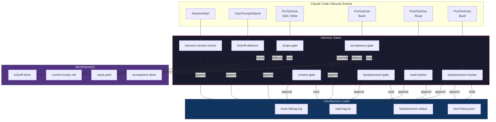
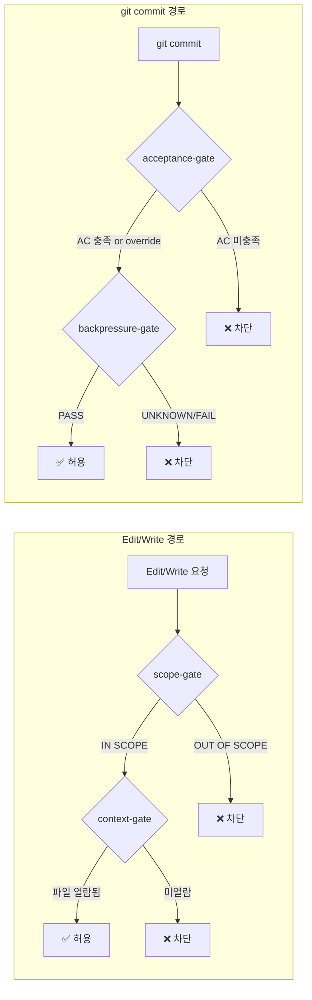
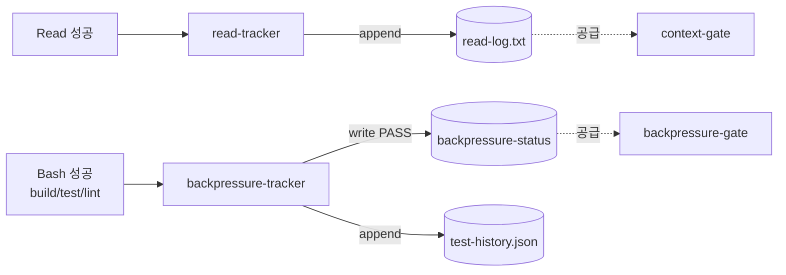
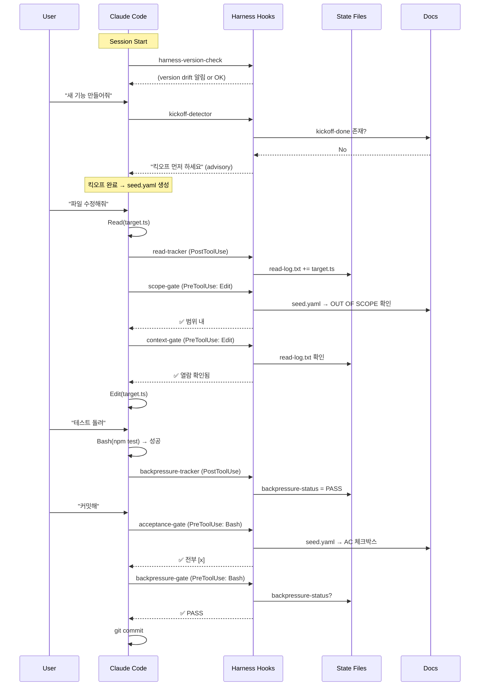
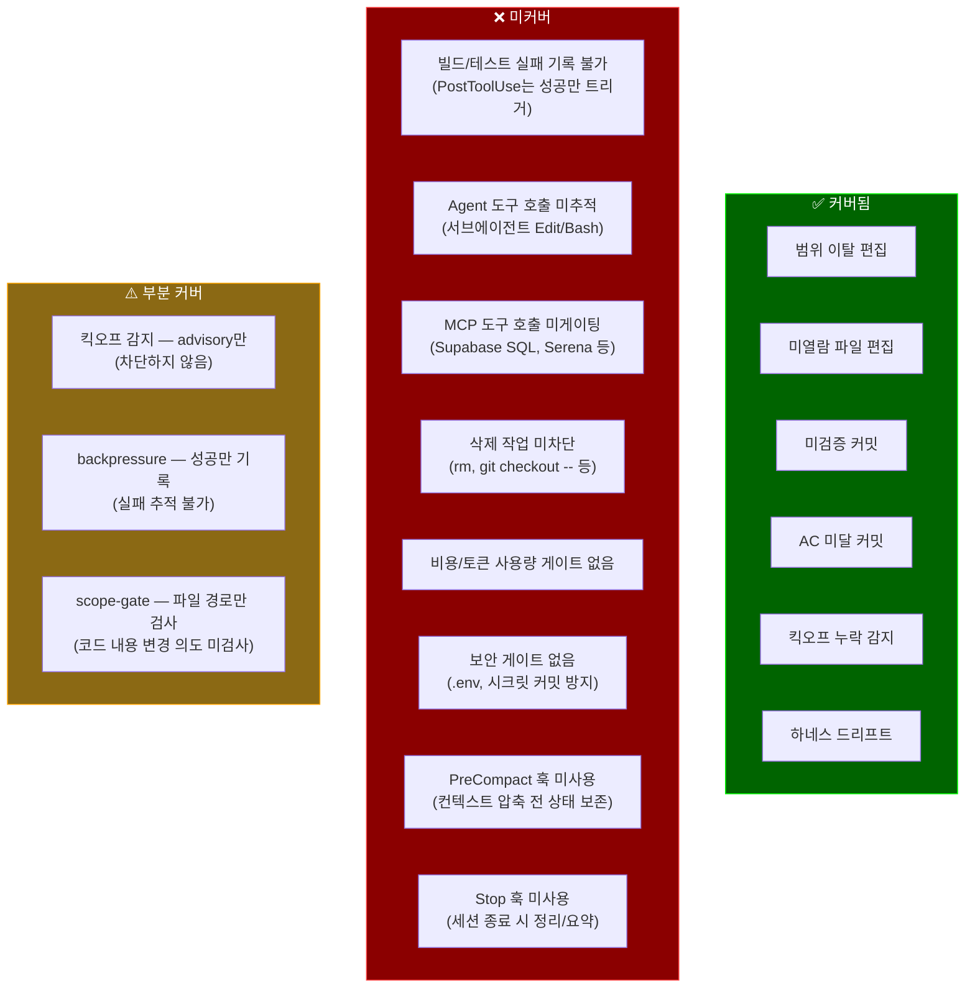
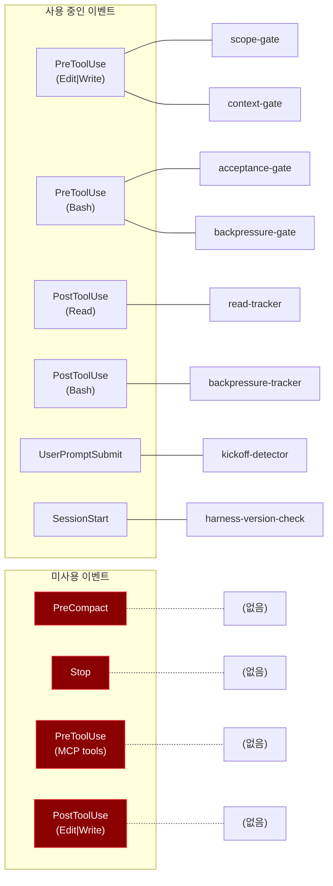
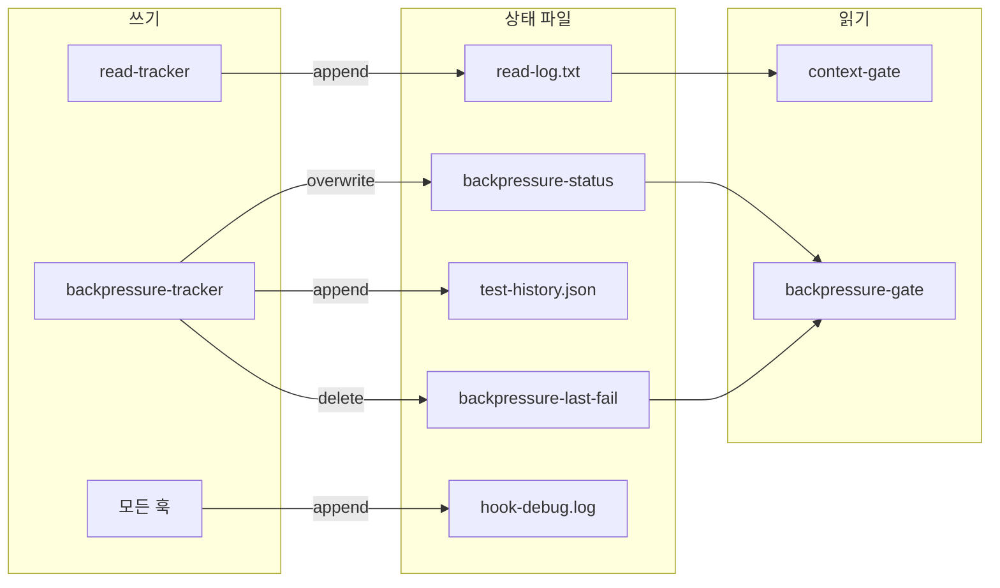

# Harness Architecture — 기능별 분류 및 커버리지 분석

> Generated: 2026-04-23 | Harness v2026.7 | Claude Code 2.1.118

## 1. 아키텍처 개요

하네스는 Claude Code의 hook 시스템 위에 구축된 **자동화된 품질 게이트 체인**이다.
에이전트의 행동을 사전/사후로 검증하여, 범위 이탈·미확인 편집·미검증 커밋을 차단한다.

## 2. 기능별 분류

### 2.1 사전 차단 게이트 (PreToolUse — blocking)

코드 변경이나 커밋이 실행되기 **전에** 조건을 검사하고, 불합격 시 `exit 2`로 차단한다.

| 게이트 | 트리거 | 검사 대상 | 차단 조건 | 데이터 소스 |
|--------|--------|-----------|-----------|-------------|
| **scope-gate** | Edit\|Write | 편집 파일 경로 | OUT OF SCOPE에 포함 | seed.yaml → current-scope.md |
| **context-gate** | Edit\|Write | 편집 파일 경로 | read-log에 없음 (미열람) | .omc/harness-state/read-log.txt |
| **acceptance-gate** | Bash (git commit) | 수락 기준 체크박스 | 미완료 `[ ]` 존재 | seed.yaml → current-scope.md |
| **backpressure-gate** | Bash (git commit) | 빌드/테스트 상태 | status ≠ "PASS" 또는 UNKNOWN | .omc/harness-state/backpressure-status |

### 2.2 사후 추적기 (PostToolUse — non-blocking)

도구 실행 **성공 후** 상태를 기록한다. 차단하지 않고, 게이트에 데이터를 공급한다.

| 추적기 | 트리거 | 역할 | 출력 |
|--------|--------|------|------|
| **read-tracker** | Read (성공) | 열람 파일 경로 기록 | read-log.txt에 append |
| **backpressure-tracker** | Bash (성공) | 빌드/테스트/린트 성공 기록 | backpressure-status, test-history.json |

### 2.3 감지기 (UserPromptSubmit — advisory)

사용자 프롬프트 제출 시 패턴을 감지하고, 차단하지 않고 **안내 메시지만** 출력한다.

| 감지기 | 트리거 | 감지 패턴 | 출력 |
|--------|--------|-----------|------|
| **kickoff-detector** | 모든 프롬프트 | 새 프로젝트/기능 키워드 (EN/KR) | kickoff 워크플로우 안내 |

### 2.4 세션 관리 (SessionStart — advisory)

세션 시작 시 1회 실행. 환경 상태를 점검한다.

| 훅 | 역할 | 캐시 | 네트워크 |
|----|------|------|----------|
| **harness-version-check** | 로컬 vs 리모트 하네스 버전 비교 | 24시간 | git ls-remote |

### 2.5 릴리스 자동화 (Git hooks)

Claude Code 훅이 아닌 **Git 자체 훅**으로 동작한다.

| 스크립트 | 트리거 | 역할 |
|----------|--------|------|
| **harness-version-bump.sh** | post-commit | 하네스 파일 변경 감지 → 버전 범프 → 태그 생성 |
| **harness-sync.sh** | /harness-check 수동 | 리모트에서 최신 하네스 오버라이트 |

## 3. 상태 흐름도 (전체 세션 라이프사이클)

## 4. 커버리지 매트릭스

### 4.1 현재 커버되는 영역

| 위험 영역 | 게이트 | 강도 |
|-----------|--------|------|
| 범위 이탈 편집 | scope-gate | **Hard block** (exit 2) |
| 미확인 파일 편집 | context-gate + read-tracker | **Hard block** (exit 2) |
| 미검증 커밋 (빌드/테스트) | backpressure-gate + tracker | **Hard block** (exit 2) |
| 수락 기준 미달 커밋 | acceptance-gate | **Hard block** (exit 2) |
| 새 작업 시 킥오프 누락 | kickoff-detector | Advisory (non-blocking) |
| 하네스 버전 드리프트 | harness-version-check | Advisory (non-blocking) |
| 하네스 파일 버전 관리 | harness-version-bump.sh | Automated (post-commit) |

### 4.2 커버되지 않는 영역 (Gap Analysis)

### 4.3 Gap 상세

#### G1. 빌드/테스트 실패 기록 불가
- **원인**: `PostToolUse`는 도구가 **성공**했을 때만 트리거됨. Bash 명령이 exit code ≠ 0 이면 훅이 실행되지 않음.
- **결과**: `backpressure-status`가 이전 PASS를 유지 → 테스트 실패 후에도 커밋 가능.
- **완화 현황**: 하네스 계약서에 known limitation으로 문서화됨.
- **대안**: PreToolUse(Bash)에서 `git commit` 직전에 강제 재검증 실행, 또는 Stop 훅에서 마지막 Bash exit code 추적.

#### G2. 서브에이전트 도구 호출 미추적
- **원인**: OMC가 executor/architect 등 서브에이전트를 생성할 때, 서브에이전트의 Edit/Write는 별도 컨텍스트에서 실행됨.
- **결과**: 서브에이전트가 read 없이 파일을 편집해도 context-gate가 감지 불가.
- **참고**: Claude Code의 현재 hook 아키텍처 제약 — 서브에이전트도 동일 hook chain을 탈 수 있으나, read-log는 세션별 독립.

#### G3. MCP 도구 호출 미게이팅
- **원인**: Supabase(DDL), Serena(리팩터링), Web Search 등 MCP 도구는 PreToolUse matcher에 등록되지 않음.
- **결과**: MCP를 통한 DB 스키마 변경, 심볼 리네이밍 등이 scope-gate를 우회.
- **대안**: `PreToolUse` matcher에 MCP 도구명 패턴 추가 (예: `mcp__supabase*`).

#### G4. 삭제 작업 미차단
- **원인**: `rm -rf`, `git checkout -- .`, `git clean` 등 파괴적 Bash 명령에 대한 게이트 없음.
- **결과**: 에이전트가 실수로 파일을 삭제할 수 있음.
- **대안**: PreToolUse(Bash)에서 위험 명령 패턴 매칭 (hook_recipes.md에 레시피 존재하나 미적용).

#### G5. 비용/토큰 사용량 게이트 없음
- **현황**: OMC HUD가 토큰 사용량을 표시하지만, 임계값 초과 시 차단하는 게이트는 없음.
- **결과**: 장시간 세션에서 과다 토큰 소비를 자동 제어할 수 없음.

#### G6. 시크릿/민감 파일 커밋 방지 없음
- **현황**: `.env`, `credentials.json`, API 키 포함 파일의 커밋을 차단하는 게이트 없음.
- **참고**: `.gitignore`가 1차 방어이나, 에이전트가 `git add -f`를 쓰면 우회됨.
- **대안**: PreToolUse(Bash)에서 `git add`/`git commit` 시 민감 파일 패턴 검사.

#### G7. PreCompact 훅 미사용
- **현황**: 컨텍스트 압축 전에 중요 상태를 보존할 기회를 활용하지 않음.
- **가능성**: 압축 전 현재 scope/AC 상태를 요약하여 압축 후 컨텍스트에 주입.

#### G8. Stop 훅 미사용
- **현황**: 세션 종료 시 정리, 요약, 상태 리셋 등의 자동화 없음.
- **가능성**: 세션 종료 시 test-history 정리, 미완료 AC 경고, 세션 요약 생성.

## 5. 훅 이벤트별 등록 현황

## 6. 상태 파일 의존성 그래프

## 7. 우선순위별 개선 제안

| 우선순위 | Gap | 제안 | 복잡도 |
|----------|-----|------|--------|
| **P0** | G1: 실패 미기록 | PreToolUse(Bash, git commit)에서 마지막 테스트를 강제 재실행하거나, Bash exit code를 별도 추적 | Medium |
| **P0** | G6: 시크릿 커밋 방지 | PreToolUse(Bash)에 `git add`/`git commit` 시 `.env`, `*credential*`, `*secret*` 패턴 검사 추가 | Low |
| **P1** | G4: 파괴적 명령 차단 | PreToolUse(Bash)에 `rm -rf`, `git checkout --`, `git clean`, `git reset --hard` 패턴 검사 | Low |
| **P1** | G3: MCP 게이팅 | PreToolUse matcher에 `mcp__supabase*\|mcp__serena*` 추가, scope 검사 연동 | Medium |
| **P2** | G8: Stop 훅 | 세션 종료 시 미완료 AC 경고 + 세션 요약 자동 생성 | Low |
| **P2** | G7: PreCompact | 압축 전 scope/AC 상태 스냅샷을 시스템 프롬프트에 주입 | Medium |
| **P3** | G2: 서브에이전트 | 서브에이전트용 read-log 공유 메커니즘 (현재 Claude Code 아키텍처 제약) | High |
| **P3** | G5: 비용 게이트 | 토큰 임계값 초과 시 경고/차단 (OMC HUD 연동) | Medium |
