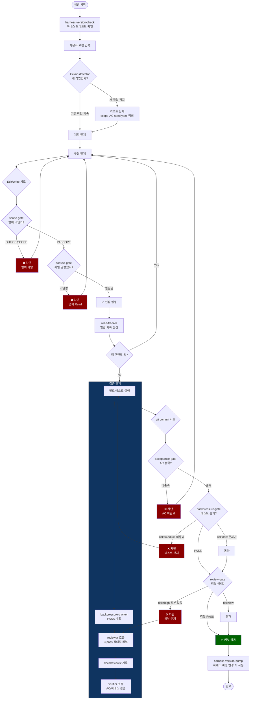
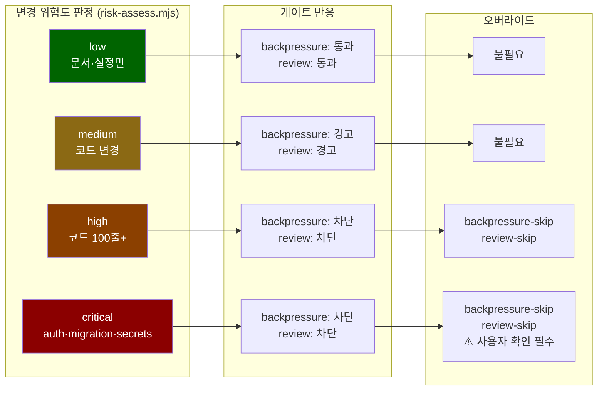
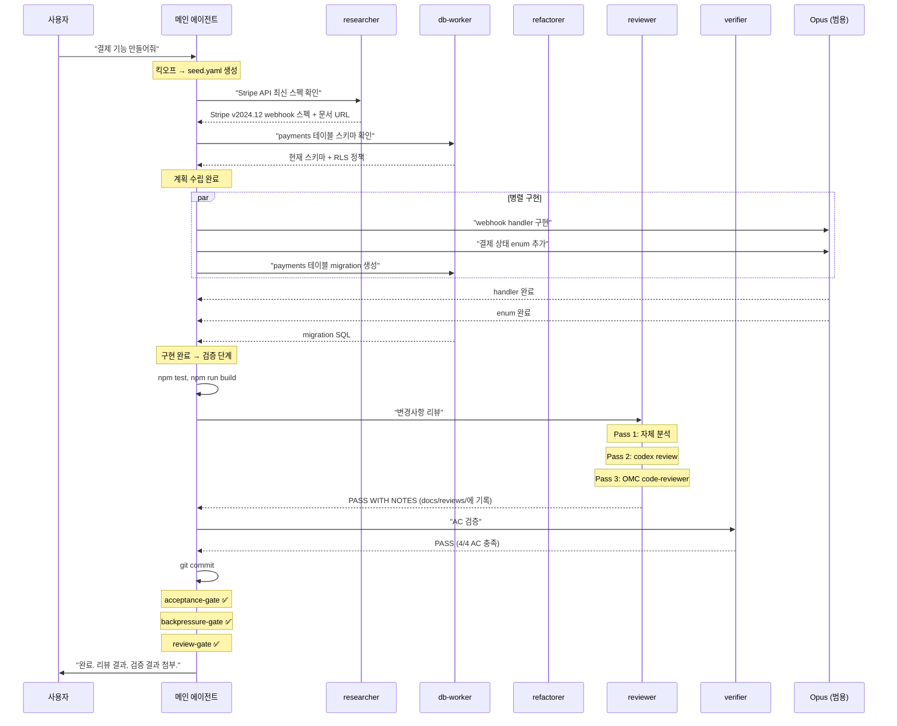

# 작업 라이프사이클 — 하네스 기반 전체 흐름

> Generated: 2026-04-24 | Harness v2026.7

## 1. 전체 흐름 (한눈에)



## 2. 단계별 상세

### 2.1 세션 시작

```
사용자가 Claude Code 세션을 시작
  → [SessionStart] harness-version-check 실행
    → 로컬 하네스 버전 vs 리모트 최신 태그 비교
    → 드리프트 있으면 알림 (24시간 캐시)
  → 시스템 프롬프트에 CLAUDE.md 로드
    → Agent Routing Policy, MCP Policy 등 활성화
```

여기서 결정되는 것: 메인 에이전트가 어떤 규칙 체계 아래에서 동작하는지.

### 2.2 킥오프 (새 작업 감지 시)

```
사용자: "새 결제 기능 만들어줘"
  → [UserPromptSubmit] kickoff-detector가 패턴 감지
    → "새 기능" 키워드 + kickoff-done 파일 없음
    → advisory: "킥오프 먼저 하세요"
  
  → 메인 에이전트가 사용자와 대화형 인터뷰
    → Goal, Constraints, AC, Out of Scope, Assumptions 정의
    → docs/harness/seed.yaml 생성
    → docs/harness/kickoff-done 생성
```

여기서 결정되는 것:
- **scope-gate**가 참조할 OUT OF SCOPE 목록
- **acceptance-gate**가 참조할 AC 체크박스
- 이후 모든 게이트의 판단 기준

### 2.3 계획

```
메인 에이전트가 구현 계획 수립
  → 복잡하면 OMC planner 활용 가능
  → 외부 정보 필요하면 researcher 호출 (Exa)
  → DB 스키마 확인 필요하면 db-worker 호출 (Supabase)
  
  이 단계에서는 Edit/Write를 안 하므로 게이트에 안 걸림
```

### 2.4 구현

```
메인 에이전트 또는 범용 Opus 서브에이전트가 코드 작성

파일을 편집하려면:
  1. 먼저 Read → read-tracker가 read-log.txt에 기록
  2. Edit/Write 시도
     → [PreToolUse] scope-gate: seed.yaml의 OUT OF SCOPE 확인
       → 범위 밖이면 차단 + 에러 메시지
     → [PreToolUse] context-gate: read-log.txt 확인
       → 미열람이면 차단 + "먼저 Read하세요"
     → 둘 다 통과하면 편집 실행

병렬 구현:
  → 독립적인 파일/모듈이면 Opus 서브에이전트 여러 개 동시 실행
  → 각 서브에이전트도 같은 hook chain을 탐 (같은 .omc/harness-state/ 공유)

MCP 필요 시:
  → DB 작업 → db-worker
  → 리팩터링 → refactorer  
  → 복합 작업 → full-context
```

### 2.5 검증

구현이 끝나면, 커밋 전에 검증 단계를 거침.

```
1. 빌드/테스트 실행
   → npm test, npm run build 등
   → [PostToolUse] backpressure-tracker가 성공 기록
     → backpressure-status = "PASS"
     → test-history.json에 추가

2. reviewer 호출 (코드 변경 ≥10줄 or 로직 변경)
   → Pass 1: reviewer 자체 분석 (Opus)
   → Pass 2: codex review --uncommitted (GPT-5.4)
   → Pass 3: Agent(oh-my-claudecode:code-reviewer) (별도 Opus)
   → 3개 결과 교차 검증
   → docs/reviews/review-YYYY-MM-DD-HHMMSS.md 기록
   → Verdict: PASS / PASS WITH NOTES / FAIL

3. verifier 호출 (AC 있을 때 필수)
   → seed.yaml AC 항목별 증거 확인
   → 하네스 게이트 상태 확인
   → 빌드/테스트 직접 재실행
   → scope 이탈 여부 확인
   → Verdict: PASS / FAIL / INCOMPLETE
```

### 2.6 커밋

```
git commit 시도
  → [PreToolUse: Bash] 3개 게이트 순차 실행:

  1. acceptance-gate
     → seed.yaml AC 체크박스 확인
     → 미완료 [ ] 있으면 → 차단
     → acceptance-done 플래그 있으면 → 통과

  2. backpressure-gate (위험도 인식)
     → risk-assess.mjs로 변경 유형 판단
     → low (문서만) → 통과
     → medium (코드) + 상태 없음 → 경고
     → high/critical + PASS 아님 → 차단
     → backpressure-skip 플래그 있으면 → 통과

  3. review-gate (위험도 인식)
     → risk-assess.mjs로 변경 유형 판단
     → low → 통과
     → medium + 리뷰 없음 → 경고
     → high/critical + 리뷰 없음 → 차단
     → 리뷰 FAIL → 차단
     → review-skip 플래그 있으면 → 통과

  전부 통과하면 커밋 성공

  → [post-commit] harness-version-bump.sh
    → 하네스 파일이 변경됐으면 버전 범프 + 태그 생성
```

### 2.7 완료 보고

```
메인 에이전트가 사용자에게 보고:
  → Applied rules
  → Evidence (파일 경로, 커맨드 출력)
  → Verification (reviewer/verifier 결과 참조)
```

## 3. 위험도별 게이트 동작 요약



## 4. 서브에이전트 호출 타이밍


